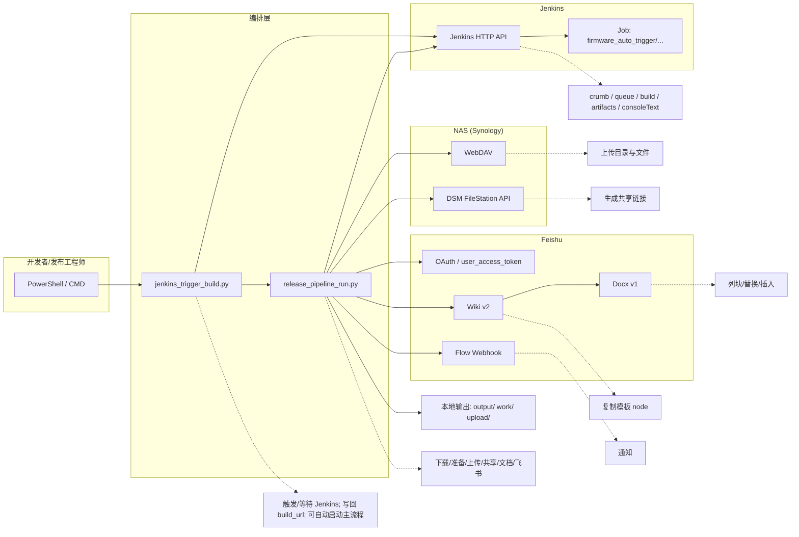
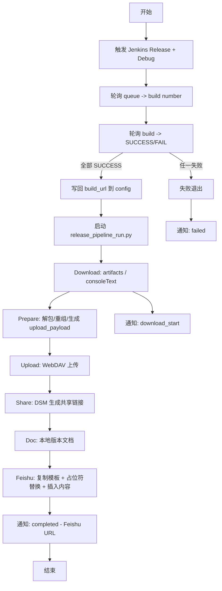
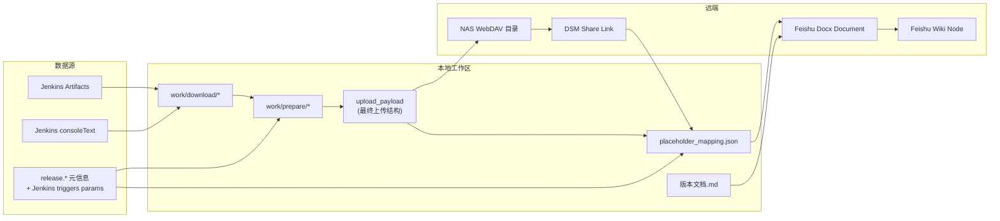

# 端到端发布链路方案设计（Jenkins → NAS → Feishu）

> 目的：把“触发构建 → 下载/准备 → NAS 上传/共享 → 生成版本文档 → Feishu 模板复制与占位符替换 → 通知”做成一条可复用、可观测、可扩展、Windows 友好的自动化链路。
>
> 适用日期：2025-12-25

---

## 1. 背景与目标

### 1.1 我们要解决什么问题

- Jenkins 构建产物（Release/Debug）完成后，自动拉取 artifact/console log。
- 按规则解包/重组输出（OTA/Cloud/Boot/Recovery/FCT 等），并形成“可上传、可分享”的目录结构。
- 上传到 NAS（WebDAV），并生成 Synology DSM 共享链接。
- 生成“版本文档”（本地 Markdown + Feishu Wiki/Docx），并用统一占位符 `{{REL_*}}` 进行替换。
- 对关键节点做飞书 Flow Webhook 通知：开始下载、构建完成、流水线成功/失败等。

### 1.2 设计目标

- 可重放：任何阶段可单独运行（download/prepare/upload/share/doc/feishu）。
- 配置驱动：核心逻辑不写死在代码里，通过 JSON 控制流程/参数/映射。
- Windows PowerShell 可靠运行：路径处理、子进程、编码、网络请求都兼容。
- 可观测：日志清晰；失败能通知；关键产物位置明确。
- 安全：敏感信息不写死（建议环境变量/私有配置文件），示例仅保留占位。

---

## 2. 整体架构（架构图）

> 说明：脚本采用“编排层 + 适配器层 + 数据/配置层”结构。



---

## 3. 脚本与职责划分

### 3.1 编排脚本列表

- `jenkins_trigger_build.py`
  - 触发 Jenkins Release/Debug 两个构建
  - 轮询 queue/build 状态
  - 写回 `release_pipeline_config*.json` 中的 `jenkins.builds.<run>.build_url`
  - 可选：构建全部成功后自动执行 `release_pipeline_run.py`（命令行或配置开关）
  - 通知：构建开始/结束（Flow webhook）

- `release_pipeline_run.py`
  - 主流程：
    - Download：拉取 artifacts、consoleText（可选）
    - Prepare：根据 DSL/规则解包整理，生成 upload_payload
    - Upload：WebDAV 上传到 NAS
    - Share：DSM 生成共享链接（可在 skip upload 时单独生成）
    - Doc：生成本地 Markdown 版本文档
    - Feishu：复制 Wiki/Docx 模板并替换占位符、插入内容
  - 通知：
    - progress（如 download_start）
    - completed / failed（失败包含 SystemExit/权限/缺文件等非 0 退出）

### 3.2 数据与目录约定

- `work/`
  - `work/download/{debug|release}/`：Jenkins 下载输出
  - `work/prepare/`：准备阶段工作目录
  - `work/prepare/release_extract/upload_payload/`：最终上传载荷（示例路径）
- `upload/`：上传阶段的中间/最终文件（按项目规则）
- `output/`：历史输出（如按 Jenkins build id 分类）

---

## 4. 配置模型（JSON）

> 配置文件示例：`release_pipeline_config.example.json`（实际使用建议拷贝为私有文件，避免敏感信息入库）

### 4.1 核心配置块

- `release.*`：项目/设备/版本/阶段等元信息
- `jenkins.*`
  - `auth`：Jenkins Basic Auth（建议环境变量或私有配置）
  - `triggers`：触发参数（Release/Debug 的 parameters）
  - `builds`：已触发构建的 build_url + 下载策略
- `prepare.*`：准备模式与工作目录
- `nas.*`
  - `webdav`：上传
  - `dsm`：共享链接
  - `remote`：远端目录策略
  - `uploads[]`：上传定义（包含 extra_local_dirs）
- `feishu.*`：wiki/docx 模板、替换、OAuth、space/folder 目标等
- `notifications.webhook.*`：Flow webhook 通知策略与 payload 模板

### 4.2 建议的“敏感信息”管理

- Jenkins/NAS/Feishu 的 token/密码不要长期写死在公开配置里。
- 推荐：
  - 私有配置文件（不提交 git）
  - 或使用环境变量（例如 `FEISHU_USER_ACCESS_TOKEN`）

---

## 5. 端到端流程（流程图）



---

## 6. 数据流设计（数据流图）

> 关注“数据在系统间如何移动/转化”。



---

## 7. 关键交互与 API 设计（Jenkins / NAS / Feishu / Webhook）

> 下文使用“典型接口形态 + 关键字段”讲解；实际 URL 以配置 `base_url/job_url` 为准。

### 7.1 Jenkins API 交互

#### 7.1.1 获取 CSRF Crumb

- `GET {base_url}/crumbIssuer/api/json`
- 目的：拿到 `{ crumbRequestField, crumb }`
- 注意点：需要 cookie 会话保持（脚本已做 cookie jar 复用），否则后续 POST 可能 403。

#### 7.1.2 触发构建（带参数）

- `POST {job_url}/buildWithParameters`
- Content-Type：`application/x-www-form-urlencoded`
- Body：来自 `jenkins.triggers.{release|debug}.parameters`

#### 7.1.3 Queue 轮询（拿 build number）

- `GET {base_url}/queue/item/{id}/api/json`
- 关键字段：
  - `executable.number`：build number
  - `executable.url`：build URL

#### 7.1.4 Build 轮询（拿结果）

- `GET {build_url}/api/json`
- 关键字段：
  - `building`：是否仍在构建
  - `result`：`SUCCESS`/`FAILURE`/`ABORTED`...

#### 7.1.5 拉取 artifacts

- `GET {build_url}/artifact/*zip*/archive.zip`（一种常见方式）
- 或逐文件下载（取决于脚本实现的 artifacts 下载策略）

#### 7.1.6 拉取 consoleText（完整控制台日志）

- `GET {build_url}/consoleText`
- 产物：保存到本地并可上传到 NAS，映射到 `{{REL_BUILD_LOG_FILE}}`

---

### 7.2 NAS WebDAV + DSM FileStation API

#### 7.2.1 WebDAV 上传

- 常用方法：`MKCOL` 创建目录（视服务端支持）、`PUT` 上传文件
- 建议：
  - 目录结构由 `nas.remote.base_dir + folder_name + uploads[].remote_subdir` 决定
  - 上传策略：overwrite / include_globs / exclude_globs

#### 7.2.2 DSM 共享链接（FileStation）

- 目标：把 NAS 上的目录/文件生成可分享 URL，回填到占位符（例如 `{{REL_RELEASE_SHARE_LINK}}` 这类）
- 典型交互（概念）：
  1) 登录/拿 sid
  2) `SYNO.FileStation.Sharing` 创建分享

> 具体 DSM API 路径和参数会受 DSM 版本影响；脚本里已封装适配。

---

### 7.3 Feishu 交互（OAuth / Wiki v2 / Docx v1）

#### 7.3.1 OAuth（获取 user_access_token）

- 本方案使用“用户身份”的 `user_access_token`（可通过 localhost 回调获取并缓存）。
- 关键点：
  - scope 必须覆盖：Wiki 复制、Docx 编辑等（例如 `wiki:wiki`, `wiki:node:copy`, `wiki:node:read`, `docx:document`）
  - token 过期/权限错误时可自动引导重新授权（脚本已有 retry 逻辑）

#### 7.3.2 Wiki v2：复制模板节点（推荐路径）

- 目的：以模板 Wiki 节点为源，在目标 space 下复制一份，并获取其 docx obj_token
- 返回字段（关键）：
  - `node_token`：新节点 token
  - `obj_type`：通常为 `docx`
  - `obj_token`：docx document_id（后续 Docx API 以此为准）
  - `url`：可直接分享的 wiki 链接

#### 7.3.3 Docx v1：占位符替换

- 逻辑：列出 blocks → 扫描文本块 → 对 `text_run.content` 做替换 → batch_update
- 关键点：
  - 占位符系统统一为 `{{REL_*}}`
  - DSL 模式下也会注入 TAG 类占位符（`REL_APP_TAG/BOOT/RECOVERY/FCT`）
  - 对跨 run 的占位符提供“flatten to single run”的兼容处理

#### 7.3.4 Docx v1：插入 Markdown（可选）

- 步骤：
  1) markdown → blocks（Feishu convert API）
  2) insert blocks descendant 到指定 parent_block_id

---

### 7.4 飞书 Flow Webhook 通知

- `POST {webhook_url}`
- Payload（示例）：
  - `{"text": "..."}`
- 事件类型（本方案）：
  - `download_start`：开始下载某个 run
  - `completed`：全流程完成（附 Feishu URL）
  - `failed`：失败退出（包含 SystemExit/缺文件/权限等）

---

## 8. 占位符与映射体系

### 8.1 占位符命名规范

- 统一格式：`{{REL_*}}`
- 示例：
  - `{{REL_DEVICE_NAME}}`, `{{REL_STAGE}}`, `{{REL_VERSION}}`
  - `{{REL_APP_TAG}}`, `{{REL_BOOT_TAG}}`, `{{REL_RECOVERY_TAG}}`, `{{REL_FCT_TAG}}`
  - `{{REL_BUILD_LOG_FILE}}`（consoleText 上传后的文件链接）

### 8.2 mapping 生成来源

- 来自 config 元信息（release.* / jenkins.triggers.*）
- 来自产物扫描（manifest/xml/md5 等）
- 来自 NAS 共享链接生成（DSM link 优先）

### 8.3 mapping 输出

- 默认会输出 mapping JSON 文件（用于排障/手工替换兜底）

---

## 9. 异常容错与失败通知策略

### 9.1 错误分级

- 可忽略（Warn）：例如“写 mapping 失败”不应阻塞主流程
- 需要人工介入（Fail）：例如缺少关键产物、权限不足导致无法写入 Feishu

### 9.2 失败通知保证

- 失败退出时强制发送 `failed` WebHook（前提 `notifications.webhook.on_failure=true`）。
- 覆盖：
  - 未捕获异常
  - `SystemExit`（配置缺失、权限不足、DSL 文件不存在等）
  - 非 0 返回码
- 避免重复：同一次失败只通知一次。

---

## 10. 权限模型（Feishu “公共目录/公共空间”）

- 使用 `user_access_token` 时：文档归属与权限通常继承用户在目标空间/目录的权限。
- 要确保“公共可编辑”：
  - 目标是 **Wiki Space**：操作者用户需要在 space 内有编辑/创建权限
  - 目标是 **Docs Folder**：操作者用户需要对 folder 有编辑权限
- 如果未来改成 `tenant_access_token`（应用身份）：需要额外考虑“应用是否被授权在该 space/folder 下写入”的资源权限与管理员授权流程。

---

## 11. 运维与演示建议（给团队讲解用）

### 11.1 推荐演示顺序

1) 讲架构：两层脚本 + 三大系统（Jenkins/NAS/Feishu）
2) 讲一次成功链路：从触发 build 到生成 Feishu 链接
3) 讲配置驱动：同一套代码如何换项目/换规则
4) 讲异常：缺文件/权限不足/网络波动，如何通知与回溯

### 11.2 推荐 Demo 命令（PowerShell）

- 仅触发 Jenkins + 等待 + 写回 build_url：
  - `python .\jenkins_trigger_build.py --config .\release_pipeline_config.json`

- 构建成功后自动跑主流程（两种方式）：
  - 命令行：`--run-pipeline`
  - 配置：`jenkins.triggers.auto_run_pipeline=true`

- 只验证主流程通知与结构（跳过大步骤）：
  - `python .\release_pipeline_run.py --config .\release_pipeline_config.json --dry-run --skip-download --skip-upload --skip-share --skip-doc --skip-feishu`

---

## 12. 可扩展点（Roadmap）

- “替换容错模式”：占位符/块替换失败时继续跑并汇总告警（best-effort + summary）。
- “Jenkins fallback 识别 build”：当代理吞 Location header 时，按时间窗口+参数匹配反查 build。
- “统一结构化事件日志”：输出 machine-readable 的 event log（用于后续接入监控/报表）。

---

## 12.1 把“图形语言”导出为图片（PNG/SVG）

你提到“整体架构图报错、希望能生成图形化架构图，并且能插入额外功能把图形语言转图片”。这里给一套可落地的方案：

### A) Mermaid（推荐：最贴近当前文档）

本方案的三张图已拆成独立源文件：

- diagrams/architecture.mmd
- diagrams/flow.mmd
- diagrams/dataflow.mmd

在 Windows + PowerShell 下导出 PNG：

```powershell
pwsh .\tools\render_mermaid.ps1
```

导出 SVG：

```powershell
pwsh .\tools\render_mermaid.ps1 -Format svg
```

导出结果默认在：

- diagrams/out/architecture.png（或 .svg）
- diagrams/out/flow.png（或 .svg）
- diagrams/out/dataflow.png（或 .svg）

然后你就可以在 Markdown 里插入图片（适合发给不支持 Mermaid 渲染的同事/平台）：

```md


```

依赖：这套导出脚本使用 `npx @mermaid-js/mermaid-cli`，需要先安装 Node.js（LTS）。

### B) PlantUML（适合更“工程化”的 UML 风格）

- 优点：时序图/组件图表达更强；很多团队已有 PlantUML 规范。
- 做法：写 `.puml`，用 VS Code PlantUML 插件或 `java -jar plantuml.jar` 导出 PNG/SVG。

### C) draw.io / Excalidraw（适合“最终分享版”）

- 优点：所见即所得、视觉更美观、适合汇报。
- 做法：Mermaid 作为“源”，导出的 PNG 作为“分享版”；或直接在 draw.io 维护最终图。

> 建议：对团队“可维护”来说，Mermaid/PlantUML 更利于版本管理；对“分享展示”来说，导出 PNG/SVG 更稳。

---

## 13. 附：脚本入口与关键参数索引

- `jenkins_trigger_build.py`
  - `--config`
  - `--dry-run`
  - `--run-pipeline`
  - `--pipeline-args=...`
  - 配置项：`jenkins.triggers.auto_run_pipeline`, `jenkins.triggers.pipeline_args`

- `release_pipeline_run.py`
  - `--config`
  - `--dry-run`
  - `--skip-download/--skip-prepare/--skip-upload/--skip-share/--skip-doc/--skip-feishu`
  - 通知配置：`notifications.webhook.*`

---

> 备注：本文件用于团队分享与方案讲解，避免在文档中硬编码任何真实密码/token。实际落地请将敏感信息放入私有配置或环境变量。
